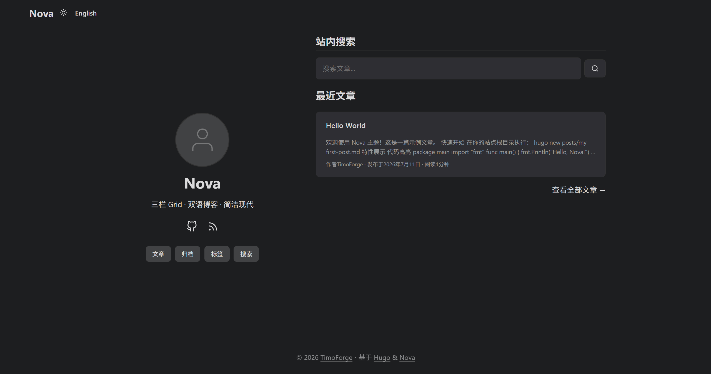

<p align="center">
  
</p>

<h1 align="center">Nova 主题</h1>

<p align="center">
  <em>专为中英双语技术博客设计的 Hugo 主题 — 三栏 Grid 布局，简约现代</em>
</p>

<p align="center">
  <a href="https://gohugo.io/">
    
  </a>

  <a href="LICENSE">
    
  </a>
  <a href="https://github.com/timoforge/hugo-theme-nova/releases">
    
  </a>
</p>

<p align="center">
  <a href="#功能特性">功能特性</a> ·
  <a href="#截图">截图</a> ·
  <a href="#快速开始">快速开始</a> ·
  <a href="#配置">配置</a> ·
  <a href="#主题架构">主题架构</a> ·
  <a href="#自定义">自定义</a>
</p>

> 📖 **English version** available at [README.md](README.md)

---

Nova 是一个功能丰富的 [Hugo](https://gohugo.io/) 博客主题，采用**三栏 Grid 布局**——侧边栏、主内容、右侧栏。它继承了 PaperMod 成熟的 CSS 变量体系和明暗切换，同时完全重构了布局并增加了大量自定义功能。

专为中英双语技术博客设计。

---

## 功能特性

- **三栏 Grid 布局** — 侧边栏 (250px) + 主内容 + 右侧栏 (240px)
- **主页分栏** — 个人资料（左）+ 搜索/最近文章（右）
- **响应式** — 三档断点至移动端单栏
- **Fuse.js 搜索** — 实时模糊搜索，键盘导航
- **时间线归档** — 按年份分组
- **标签索引** — A-Z 分组 + 中文拼音排序
- **中英双语** — 默认中文，一键切换，页面级语言记忆
- **右侧栏小部件** — 时间问候、站点介绍、每日一言、运行时长
- **明暗模式** — 自动切换
- **SEO** — JSON-LD 结构化数据、RSS

---

## 截图

| 页面     | 布局                                |
| -------- | ----------------------------------- |
| 首页     | 左右分栏：个人资料 + 搜索和最近文章 |
| 文章详情 | 三栏：侧边栏 + 内容 + TOC           |
| 归档     | 三栏：时间线按年份分组              |
| 标签     | 三栏：A-Z 索引 + 拼音排序           |
| 搜索     | 三栏：搜索框 + 热门标签             |
| 移动端   | 单栏堆叠                            |

---

## 快速开始

### 预览（克隆即用）

```bash
git clone https://github.com/timoforge/hugo-theme-nova.git
cd hugo-theme-nova
hugo server -D
```

打开 `http://localhost:1313/` — HelloWorld、搜索、归档，全部就绪。

### 安装到你的站点

```bash
cd your-site
git submodule add https://github.com/timoforge/hugo-theme-nova themes/nova
```

在 `hugo.toml` 中：

```toml
theme = 'nova'
defaultContentLanguage = 'zh'
```

或复制完整示例：

```bash
cp themes/nova/exampleSite/hugo.toml .
cp -r themes/nova/exampleSite/content/* content/
hugo server -D
```

> 设置 `[params] preferChineseHome = false` 可切为英文首页。
> 主题默认配置在 `config/_default/`，可按需覆盖。

---

### 基础配置

```toml
theme = 'nova'
defaultContentLanguage = 'zh'
hasCJKLanguage = true

[params]
  ShowReadingTime = true
  ShowToc = true
  ShowCodeCopyButtons = true
  defaultTheme = 'auto'
```

> 完整配置参考 [`config/_default/`](config/_default/)。
> 设置 `[params] preferChineseHome = false` 可切为英文首页。

---

## 主题架构

```

```

themes/nova/
├── assets/
│ ├── css/
│ │ ├── core/ # PaperMod 核心 CSS（变量、重置、媒体查询）
│ │ ├── common/ # PaperMod 通用样式
│ │ ├── includes/ # Chroma 语法高亮
│ │ └── extended/ # ⭐ 自定义 CSS（5 个文件）
│ │ ├── sidebar.css # 三栏 Grid + 侧边栏 + TOC
│ │ ├── custom.css # 首页布局、导航、页脚
│ │ ├── search.css # 搜索页样式
│ │ ├── tagcloud.css # 标签云样式
│ │ └── social-icons.css
│ └── js/
│ ├── fastsearch.js # ⭐ 自定义 Fuse.js 搜索实现
│ ├── fuse.basic.min.js # Fuse.js 库
│ └── license.js
├── config/\_default/ # 主题默认可合并配置
├── exampleSite/ # ⭐ 示例站点（内容 + 配置 + 静态资源）
│ ├── hugo.toml
│ ├── content/
│ └── static/
├── i18n/ # 46 种语言翻译
├── layouts/
│ ├── partials/ # 模板部件（Hugo 0.146+）
│ │ ├── sidebar_profile.html # ⭐ 侧边栏
│ │ ├── right_sidebar.html # ⭐ 右侧小部件
│ │ ├── toc.html # ⭐ TOC（始终展开 + 滚动高亮）
│ │ ├── head.html # ⭐ <head>（CSS/JS 管线、SEO）
│ │ ├── header.html # ⭐ 导航栏
│ │ ├── footer.html # ⭐ 页脚（备案信息）
│ │ ├── social_icons.html # ⭐ 社交图标
│ │ └── ... # PaperMod 原始部件
│ ├── single.html # ⭐ 文章详情（三栏）
│ ├── list.html # ⭐ 首页 + 列表（分栏）
│ ├── archives.html # ⭐ 时间线归档
│ ├── search.html # ⭐ 搜索页
│ ├── taxonomy.html # ⭐ 标签索引（A-Z + 拼音）
│ ├── \_default/term.html # 标签详情页
│ └── posts/list.html # 文章列表
├── images/
│ ├── screenshot.png # 主题截图
│ └── tn.png # 缩略图
├── archetypes/
├── hugo.toml # 本仓库本地预览配置
├── theme.toml # 主题元数据
├── README.md # 主题文档（英文版）
├── README-zh.md # 主题文档（中文版）
├── LICENSE # MIT 许可证
└── go.mod # Go 模块

````

> ⭐ = 与 PaperMod 存在差异或新增的文件

### 页面布局速查

| 页面       | 布局     | 说明                                 |
| ---------- | -------- | ------------------------------------ |
| 首页 (`/`) | 左右分栏 | 个人资料（左）+ 搜索和最近文章（右） |
| 文章详情   | 三栏     | 侧边栏 + 内容 + TOC                  |
| 文章列表   | 三栏     | 侧边栏 + 文章 + 右侧栏               |
| 归档       | 三栏     | 侧边栏 + 时间线 + 右侧栏             |
| 搜索       | 三栏     | 侧边栏 + 搜索 + 右侧栏               |
| 标签       | 三栏     | 侧边栏 + 标签索引 + 右侧栏           |
| 标签详情   | 三栏     | 侧边栏 + 文章 + 信息面板             |

---

## 自定义

### CSS 变量

PaperMod 的 CSS 变量体系确保主题一致性：

```css
/* 核心变量（PaperMod 驱动明暗切换） */
color: var(--primary); /* 主要/链接 */
color: var(--secondary); /* 次要 */
background: var(--bg); /* 页面背景 */
background: var(--entry); /* 卡片背景 */
border-color: var(--border); /* 边框 */
background: var(--tertiary); /* 悬停背景 */
````

### 布局变量

```css
:root {
  --sidebar-w: 250px; /* 左侧边栏宽度 */
  --toc-w: 240px; /* 右侧栏宽度 */
  --top-offset: 6rem; /* 粘性定位起始 */
  --gap-col: 2rem; /* 列间距 */
  --avatar-size: 130px; /* 头像大小（桌面端） */
  --avatar-size-mobile: 100px; /* 头像大小（移动端） */
}
```

### 内容写作

```yaml
---
title: "文章标题"
date: 2026-05-25T00:00:00+08:00
slug: "article-slug"
categories: ["分类"]
tags: ["标签1", "标签2"]
draft: false
---
```

**双语文章**：主文件 `xxx.md`（中文）+ `xxx.en.md`（英文），`date` 保持一致。

---

## 更新日志

- **v1.0.0** (2026-07-11) — 初始发布：三栏 Grid 布局

---

## 贡献

欢迎提交 Issue 和 Pull Request！

1. Fork 本仓库
2. 创建功能分支：`git checkout -b feature/my-feature`
3. 提交：`git commit -am 'Add my feature'`
4. 推送：`git push origin feature/my-feature`
5. 提交 Pull Request

---

## 许可证

MIT License — 详见 [LICENSE](LICENSE)。

---

<p align="center">
  <sub>技术观察 · 产品体验 · 工程实践 · 个人成长 · 长期主义</sub>
</p>
